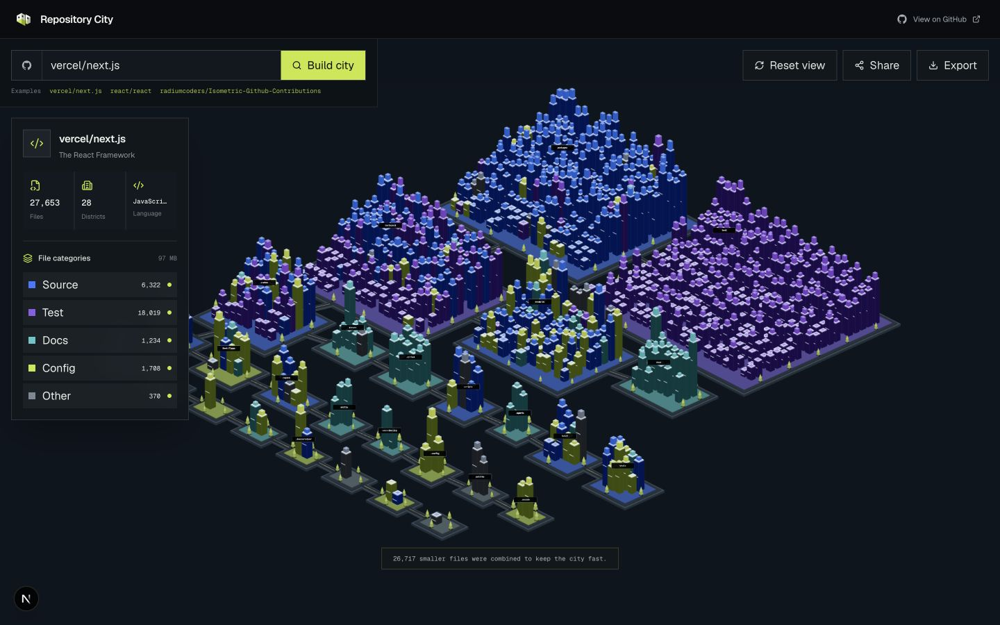

<div align="center">
  <h1>Repository City</h1>
  <p>Turn any public GitHub repository into an interactive isometric city.</p>
  <p><a href="https://repository-city.vercel.app"><strong>Open the live city →</strong></a></p>
  <p>
    <a href="https://github.com/parrisdigital/repository-city/actions/workflows/ci.yml"></a>
    <a href="https://github.com/parrisdigital/repository-city/stargazers"></a>
    <a href="https://github.com/parrisdigital/repository-city/forks"></a>
    <a href="./LICENSE"></a>
    <a href="https://github.com/parrisdigital/repository-city/commits/main"></a>
  </p>
</div>



## Overview

Repository City turns a public GitHub profile or repository into a navigable 3D city. For profiles, every public repository becomes its own connected neighborhood and that repository's files become buildings. For individual repositories, top-level directories become districts and files become buildings. The result is deterministic, shareable, filterable, and exportable.

There is no database, account, or repository upload. The app uses a thin Next.js API route to request public repository metadata from GitHub and renders the resulting city locally in the browser.

## Features

- **Public profile metropolises** — paste a profile URL or username to join every public repository city into one world.
- **File-level repository cities** — paste a repository URL or `owner/repository` to explore its source tree.
- **Architectural data mapping** — folders form districts and files become buildings.
- **Useful visual categories** — source, tests, documentation, configuration, and other files use distinct materials.
- **Large-repository aggregation** — oversized trees are condensed to a safe rendering budget while preserving totals.
- **Interactive exploration** — orbit, pan, zoom, reset the camera, and hover buildings for file metadata.
- **GitHub deep links** — select a building to open its source file.
- **Layer controls** — hide or show file categories without rebuilding the city.
- **Shareable routes** — every city has a `/city/{owner}/{repository}` URL.
- **PNG export** — save the current Three.js view.
- **Responsive experience** — desktop information rail and touch-friendly mobile bottom sheet.
- **Graceful failure modes** — validation, not-found, rate-limit, empty-tree, aggregate, and WebGL fallback states.

## How repositories become cities

### GitHub profiles

| Profile data           | City representation                        |
| ---------------------- | ------------------------------------------ |
| Public repository      | Connected neighborhood / repository city   |
| Repository source file | Building                                   |
| File size              | Primary building height                    |
| File category          | Building color                             |
| Repository name        | District label                             |
| GitHub file path       | Hover detail and click-through destination |

### Individual repositories

| Repository data     | City representation           |
| ------------------- | ----------------------------- |
| Top-level directory | District                      |
| Nested path         | Building placement            |
| File                | Building                      |
| File size           | Logarithmically scaled height |
| Source file         | Cobalt building               |
| Test file           | Violet building               |
| Documentation       | Cyan building                 |
| Configuration       | Chartreuse building           |
| Other file          | Slate building                |
| GitHub path         | Hover detail and source link  |

Generated and binary content, lockfiles, vendored dependencies, build output, source maps, and unusually large blobs are excluded from the visual model. Large repositories combine smaller files by district, category, and language to preserve responsiveness.

## Quick start

### Requirements

- Node.js 22+
- pnpm 10+

### Local development

```bash
git clone https://github.com/parrisdigital/repository-city.git
cd repository-city
pnpm install
cp .env.example .env.local
pnpm dev
```

Open `http://localhost:3000` and enter a public GitHub profile or repository.

### Environment variables

| Variable               | Required | Description                                                                                 |
| ---------------------- | -------- | ------------------------------------------------------------------------------------------- |
| `GITHUB_TOKEN`         | No       | Server-only GitHub token for higher API limits. Public unauthenticated requests still work. |
| `NEXT_PUBLIC_SITE_URL` | No       | Canonical deployment URL used by metadata and sharing.                                      |

Never expose `GITHUB_TOKEN` through a `NEXT_PUBLIC_` variable.

## Architecture

```text
app/
  api/city/route.ts                 GitHub-backed city API
  city/[owner]/[repository]/        Shareable city routes
  profile/[owner]/                  Shareable profile-city routes
components/
  city/                             Application shell and Three.js scene
lib/
  city/                             Classification, aggregation, and layout
  github/                           Input parsing and GitHub client
tests/e2e/                           Browser workflow tests
docs/design/                         Accepted desktop and mobile concepts
docs/plans/                          Product and architecture specification
```

The rendering layer uses Three.js, React Three Fiber, and Drei. Buildings are grouped into instanced meshes so large cities do not create one React component or draw call per file. The GitHub boundary and city layout remain pure TypeScript modules and are tested independently from WebGL.

## Scripts

| Command          | Purpose                               |
| ---------------- | ------------------------------------- |
| `pnpm dev`       | Start the local Next.js server        |
| `pnpm build`     | Create a production build             |
| `pnpm lint`      | Run ESLint with zero warnings allowed |
| `pnpm typecheck` | Run strict TypeScript checks          |
| `pnpm test`      | Run unit tests                        |
| `pnpm test:e2e`  | Run Playwright browser tests          |
| `pnpm format`    | Format the repository                 |
| `pnpm check`     | Run the complete local quality gate   |

## Deployment

The project is designed for Vercel's Git integration:

1. Import `parrisdigital/repository-city`.
2. Add `GITHUB_TOKEN` to Development, Preview, and Production as appropriate.
3. Set `NEXT_PUBLIC_SITE_URL` to the production URL.
4. Use `main` as the production branch.
5. Keep preview deployments enabled for pull requests.

The upstream GitHub fetch is cached while client requests remain fresh enough to rebuild layouts after code changes.

## Contributing

Read [CONTRIBUTING.md](CONTRIBUTING.md) before opening a pull request. Every change should pass formatting, linting, type checking, unit tests, and the production build. Visual changes should include screenshots or a short recording.

## Inspiration

Repository City was inspired by [radiumcoders/Isometric-Github-Contributions](https://github.com/radiumcoders/Isometric-Github-Contributions), a project that transforms GitHub contribution history into a shareable 3D landscape. Repository City carries that data-to-geometry idea into repository structure with an original implementation, layout system, and visual identity.

Thanks to [shieldcn](https://github.com/jal-co/shieldcn) for the README badges.

## License

[MIT](LICENSE) © 2026 Parris Digital
